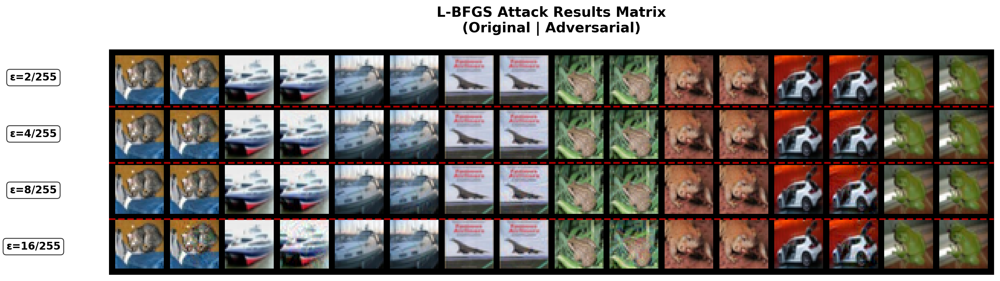
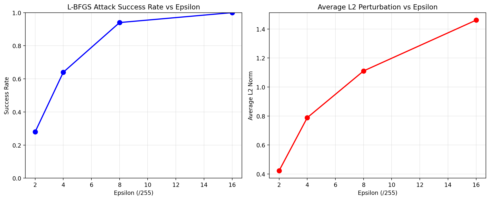
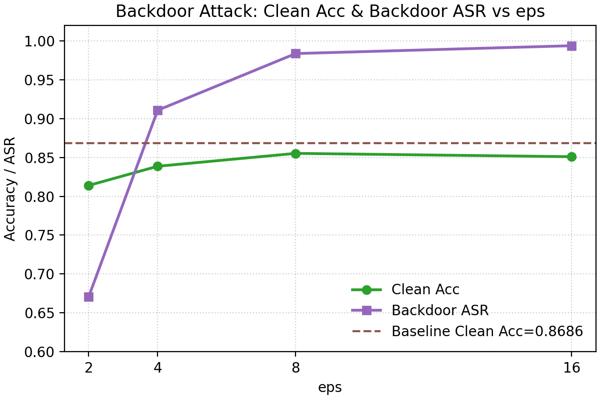

# 对抗样本生成与后门攻击实验

### 环境要求
创建 conda 环境并安装依赖
```bash
pip install torch torchvision matplotlib numpy pandas tensorboard tqdm
```

### 文件结构
```
├── train.py                      # 问题1：训练标准ResNet18模型
├── attack_lbfgs_eps.py           # 问题1：L-BFGS 攻击实现
├── eval_lbfgs_attack.py          # 问题1：L-BFGS 攻击评估
├── generate_universal_trigger.py # 问题2：生成通用触发器
├── train_backdoor.py             # 问题2：训练带后门的模型
├── evaluate_backdoor.py          # 问题2：评估后门攻击效果
├── utils.py                      # 通用工具函数
└── README.md
```

## 实验流程

### 问题1：对抗样本攻击

#### 1.1 训练标准模型
```bash
bash train.sh
```

#### 1.2 执行对抗攻击
```bash
bash eval_lbfgs_attack.sh
```

#### 1.3 关键实现细节

**L-BFGS攻击算法**：
- 使用L-BFGS优化器计算扰动
- 约束条件：`||δ||_∞ ≤ ε`

### 问题2：后门攻击

#### 2.1 生成通用触发模式
```bash
bash generate_universal_trigger.sh
```

#### 2.2 训练带后门的模型
```bash
bash train_backdoor.sh
```

#### 2.3 评估后门攻击效果
```bash
bash evaluate_backdoor.sh
```

## 实验结果

### 对抗攻击结果






| eps | ASR | L2 |
|-----|-----|-----|
| 2 | 0.28 | 0.4209 |
| 4 | 0.66 | 0.7755 |
| 8 | 0.94 | 1.1634 |
| 16 | 1.00 | 1.4088 |

### 后门攻击结果



| setting | eps | poison_frac | backdoor_target | clean_acc | backdoor_asr |
|---------|-----|-------------|-----------------|-----------|--------------|
| baseline | - | - | - | 0.8686 | - |
| attack | 2 | 0.1 | 0 | 0.8140 | 0.6706 |
| attack | 4 | 0.1 | 0 | 0.8387 | 0.9108 |
| attack | 8 | 0.1 | 0 | 0.8553 | 0.9838 |
| attack | 16 | 0.1 | 0 | 0.8510 | 0.9939 |

## 防御方法

- 在数据输入模型前进行去噪/色彩抖动等操作, 在像素空间破坏触发器
- 用户在使用前使用 clean 数据进行微调
- 在推理时将目标图像与多个 clean 数据混合, 检测混合后的模型类别输出熵值, 越小越可能是后门攻击 (可能更有利于于固定模式的触发器的检测)

## 参考文献

1. Szegedy, C., et al. "Intriguing properties of neural networks." arXiv preprint arXiv:1312.6199 (2013).
2. Gu, T., et al. "BadNets: Identifying vulnerabilities in the machine learning model supply chain." arXiv preprint arXiv:1708.06733 (2017).